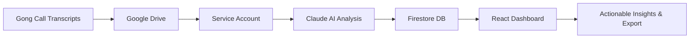

<<<<<<< HEAD
# Gong Call Intelligence

<div align="center">

**Turn raw Gong call transcripts into structured, actionable sales intelligence**
<br><br>
[](https://bun.sh)
[](https://www.typescriptlang.org)
[](https://react.dev)
[](https://claude.ai)
<br><br>
🚀 v1.0 Shipped | 📊 3,296 LOC TypeScript | ⚡ Zero build errors

</div>

---

## The Problem

Sales teams spend **hours** reviewing call recordings to extract insights. Key problems:

- **Information buried** - Critical customer sentiment, objections, and opportunities lost in transcript noise
- **Inconsistent coaching** - Knowledge not captured or shared systematically across the team
- **Reactive management** - Managers see issues too late, no visibility into team-wide patterns
- **Repetitive work** - Each rep re-learns the same lessons from individual calls

---

## The Solution

Gong Call Intelligence uses **Claude AI** to automatically analyze sales calls and generate structured, actionable reports:



### Core Capabilities

- **8-Dimension Analysis**: Summary, sentiment, scorecard, signal flags, what worked, recommendations
- **Bulk Processing**: Analyze multiple calls with single click
- **Signal Flags**: Detect competitors, pricing/technical objections, champion/blocker dynamics
- **Actionable Recommendations**: Context-specific suggestions tied to transcript moments
- **Domain-Secure**: Google SSO restricted to cast.ai only

---

## Key Features

### 📊 Call Analysis
- **Overall Summary** - AI-generated call highlights
- **Sentiment Analysis** - Customer and rep sentiment tracking with key moments
- **Scorecard** - 15+ dimensions scored (communication, product knowledge, process)
- **Signal Flags** - Detect competitors, objections, champions/blockers automatically

### 📤 Export & Sharing
- **Markdown Export** - Copy-paste ready reports for sharing
- **Structured Data** - Easy integration with other tools (CRM, notes, knowledge base)

### ⚡ Workflow
- **Date Range Search** - Filter calls by date range
- **Bulk Analysis** - Select multiple calls, one-click analyze
- **Status Tracking** - Real-time analysis progress with polling
- **Active Row Highlighting** - Visual context of selected call

### 🎯 Sales Coaching Framework
Based on **7-step sales coaching methodology**:
1. Context & Strategy
2. Communication & Technique
3. Product Knowledge & Positioning
4. Objection Handling
5. Process & Follow-through
6. Customer-Centric Mindset
7. Continuous Improvement

---

## How It Works

```
1. Login with Google SSO (cast.ai only)
   ↓
2. Select date range and search calls
   ↓
3. Click "Analyze" on any call
   ↓
4. Wait 15-30s for Claude AI analysis
   ↓
5. Review structured report with:
   - Summary & sentiment
   - Scorecard breakdown
   - Signal flags (competitors, objections)
   - What went well/poorly
   - Specific recommendations
   ↓
6. Download as Markdown for sharing
```

---

## Business Impact

### Time Savings
| Before | After |
|--------|-------|
| 60-90 minutes per call review | 3-5 minutes阅读 analysis |
| Manual transcript parsing | Automated extraction |
| Rep individual learning | Team-wide knowledge capture |

### Better Outcomes
- **Consistent coaching** - Standardized framework across all reps
- **Pattern detection** - Spot recurring objections and successes team-wide
- **Proactive management** - See team performance trends before they become problems
- **Faster ramp time** - New reps learn from 100+ analyzed calls, not just their own

### Real-World Value
- **Reps**: Focus on selling, not reviewing. Use AI insights as coaching reference.
- **Managers**: Identify team-wide issues early (e.g., "Competitor X mentioned in 50% of deals this week")
- **Team: Share best practices effectively ("See how Sarah handled pricing objection")**

---

## Getting Started

### Prerequisites

- cast.ai email address (domain restriction enforced via Google SSO)
- Google Drive folder containing Gong call transcripts
- Access to the application deployment

### Installation

```bash
# Clone the repository
git clone https://github.com/your-org/gong-intel.git
cd gong-intel

# Install dependencies
bun install

# Configure environment variables
cp apps/web/.env.example apps/web/.env
cp apps/api/.env.example apps/api/.env
# Edit .env files with your credentials
```

### Environment Variables

**API (apps/api/.env):**
```bash
# Google Cloud
GOOGLE_SERVICE_ACCOUNT_KEY=...  # JSON key from GCP
FIRESTORE_PROJECT_ID=...

# Anthropic Claude
ANTHROPIC_API_KEY=...

# OAuth
GOOGLE_CLIENT_ID=...
GOOGLE_CLIENT_SECRET=...
JWT_SECRET=...

# App
ALLOWED_DOMAIN=cast.ai
VITE_GONG_BASE_URL=https://us-3800.app.gong.io/call?id=
```

### Development

```bash
# Start both API and web servers
bun run dev

# Run individually
bun run dev:api   # API on :3001
bun run dev:web   # Web on :5173

# Build for production
bun run build
```

### Deployment

Deployment infrastructure is ready (Dockerfile + Cloud Run script):
```bash
# See scripts/deploy.sh for Cloud Run deployment
# Requires: GCP_PROJECT_ID, GCP_REGION environment variables
```

---

## Architecture

### Tech Stack

| Layer | Technology |
|-------|-----------|
| **Runtime** | Bun (monorepo workspaces) |
| **API** | Hono (TypeScript) |
| **Frontend** | React 19 + Vite + Tailwind CSS |
| **Database** | Firestore (Firebase Admin SDK) |
| **AI** | Claude Sonnet 4 (Anthropic SDK) |
| **Auth** | Google OAuth 2.0 (domain-restricted) |
| **Storage** | Google Drive (service account, read-only) |
| **Deployment** | Docker + Google Cloud Run + Cloud Storage |

### System Architecture

```
┌─────────────────────────────────────────────────────────────┐
│                    User Browser (React)                     │
│                    Port 5173 (dev) / Cloud Storage          │
└────────────────────────┬────────────────────────────────────┘
                         │ HTTPS
                         ▼
┌─────────────────────────────────────────────────────────────┐
│                   Hono API Server                           │
│                   Port 3001 (dev) / Cloud Run               │
│  ┌────────────┐ ┌────────────┐ ┌────────────┐              │
│  │ Google     │ │ Claude AI  │ │ Google     │              │
│  │ OAuth      │ │ Analysis   │ │ Drive      │              │
│  └────────────┘ └────────────┘ └────────────┘              │
│                         ▼                                     │
│                  ┌────────────┐                              │
│                  │ Firestore  │                              │
│                  └────────────┘                              │
└─────────────────────────────────────────────────────────────┘
```

### Data Flow

1. **Auth**: User signs in with Google → JWT created → Cookie stored
2. **Call Listing**: API lists Drive files → Parses transcripts → Filters by user participation → Returns to frontend
3. **Analysis Trigger**: User clicks "Analyze" → Background job starts → Frontend polls for status
4. **AI Analysis**: Claude processes transcript → Returns 8-dimension analysis → Stored in Firestore
5. **Display**: Frontend fetches analysis → Renders structured report with markdown

---

## Roadmap

### Short-Term (Immediate)

- [x] Single-page dashboard redesign (merged CallDetail into Dashboard)
- [ ] Enhanced markdown export formatting
- [ ] Improved status polling UX
- [ ] Bulk download/export capability

### 🎯 Manager's View (Priority 1)

**Goal**: Empower managers with team-wide visibility and rep performance data

- [ ] **Team Dashboard**
  - Aggregate metrics: call volume, average sentiment, analysis coverage
  - At-a-glance KPI cards (e.g., "Top 3 Objections This Week")
  - Custom date range filtering with trend visualization
  - Comparison views (week-over-week, month-over-month)

- [ ] **Rep Performance**
  - Scorecard averages across all calls per rep
  - Objection handling effectiveness scores
  - Call volume vs. analysis coverage tracking
  - Peer comparison charts (percentiles across team)

- [ ] **Cohort Insights**
  - New reps (<90 days) vs. veterans performance
  - Deal stage analysis by cohort
  - Area of focus: specific product lines or customer segments
  - Best practice sharing: highlight top-performing reps' strategies

### 📊 Team Analysis (Priority 2)

**Goal**: Enable comparative analysis and trend identification across the team

- [ ] **Cross-Rep Comparison**
  - Side-by-side scorecard comparison
  - Objection type frequency across reps
  - Talk ratio analysis (listening vs. speaking balance)
  - Sentiment trajectory patterns

- [ ] **Trend Tracking**
  - Weekly/monthly sentiment charts
  - Objection trend over time (which objections decreasing?)
  - Scorecard dimension trends (which areas improving?)
  - Deal stage correlation with specific behaviors

- [ ] **Cohort-Based Insights**
  - "Similar calls" clustering for benchmarking
  - Performance by deal size or industry vertical
  - Regional or team subgroup comparisons
  - Time-of-day performance analysis

### 🔮 Future

- [ ] **PDF Export**: Official reports for sharing with stakeholders
- [ ] **Automated Reporting**: Weekly summary emails with key insights
- [ ] **CRM Integration**: Salesforce, HubSpot synchronization
- [ ] **Custom Scorecards**: Template system for different call types
- [ ] **Real-Time Coaching**: Live transcript analysis during calls (future)
- [ ] **Voice Analysis**: Prosody and emotion detection (future)

---

## Tech Stack Details

### Frontend Dependencies
```json
{
  "react": "^19.0.0",
  "react-dom": "^19.0.0",
  "react-router-dom": "^7.1.0",
  "recharts": "^2.15.0",
  "tailwindcss": "^3.4.0",
  "vite": "^6.0.0"
}
```

### Backend Dependencies
```json
{
  "@hono/zod-validator": "^0.2.2",
  "@upstash/redis": "^1.28.0",
  "jose": "^5.9.0",
  "marked": "^17.0.3",
  "zod": "^3.23.8"
}
```

### Full Project Stats
- **TypeScript Files**: 33
- **Total Lines of Code**: 3,296 LOC
- **Build Status**: ✅ Zero errors
- **Test Coverage**: ⚠️ Not yet implemented (tech debt)
- **Deployment**: Ready (Cloud Run + Cloud Storage)

---

## Contributing

This is an **internal tool at cast.ai**. Contributions from team members are welcome!

### How to Contribute

1. Fork the repository
2. Create a feature branch (`git checkout -b feature/amazing-feature`)
3. Commit your changes (`git commit -m 'feat: add amazing feature'`)
4. Push to the branch (`git push origin feature/amazing-feature`)
5. Open a Pull Request

### Development Guidelines

- **Strict TypeScript**: No `any` types, no `console.log` (use logger)
- **Error Handling**: Use `AppError` hierarchy with proper status codes
- **Testing**: Add tests for new features (unit/integration/e2e)
- **Documentation**: Update README for user-facing changes
- **Code Style**: Follow existing patterns, use Prettier auto-format

---

## License

MIT License - See [LICENSE](LICENSE) file for details.

---

<p align="center">
  <sub>Built at cast.ai with ❤️ using Claude AI</sub>
</p>
>>>>>>> 06f79eb (docs: add GitHub README for Gong Call Intelligence)
